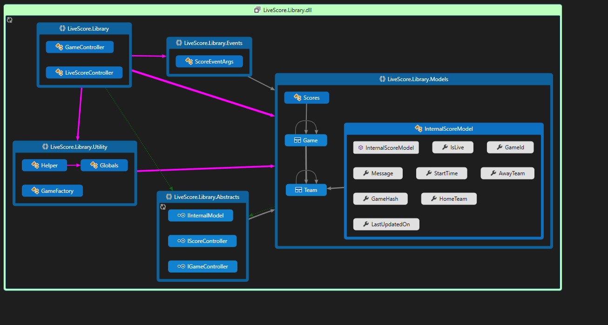
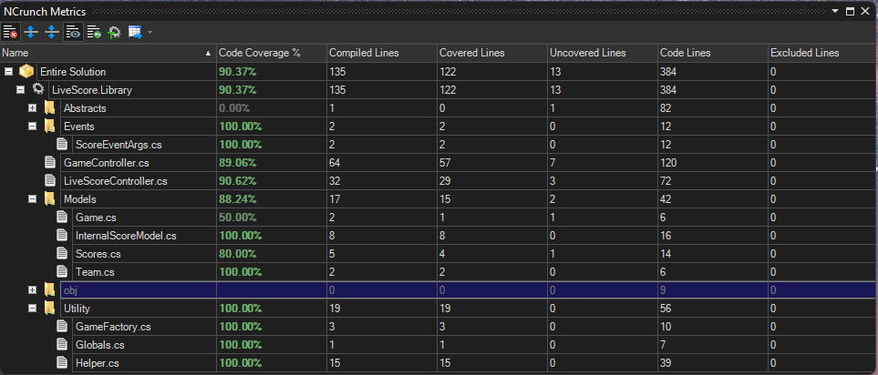

# SportRadar.LiveScoreLibrary

The document describes the implementation logic of Live Football match reporting in a library project.
Detailed requirements document is provided next to this wiki page. However this wiki describes the technical `assumptions` made, `logics` & `rules` applied while implementing it.

Also, it includes the technical guide to consume in the client-apps.

___
# Requirement 
Implement a simple 'Live WorldCup Football Score Board', as a Library project for the client-apps to consume it and control the whole workflow of the match.

### Environment & Tooling
  - Windows eco-system 
      - Visual studio 2022
      - NUnit for testing framework 
      - NCrunch for better Test Experience 
      - 
  - Architecture 
    - X64 based DLL, Library project
    - .NET 6 framework for DLL  
    - C# 10 
  - ReSharper 
    - Project dependency diagram 
    - Code-map
  
### Prerequisite & Usage
- Consume the DLL in any .NET eco systems a version ***not lower*** than `6.0` and uses some `C# 10` 
- X64 is the default configuration used to build the package

## Functional Requirement
Basically the DLL exposes 4 broad category of functions.
- `Start Game` -> Initialize the game with 2 team with score (0,0)
- `Update Score` -> Keep updating the score of both teams same time
- `Summary` -> Provide the live score of **games under progress** [ + Sorting Logic]
- `Finished` -> Once the game ends, remove from the summary [No history saved]

## Architecture and Code coverage 

Below is the diagram of the whole Library code map, that shows the sage of types, structure and usage in high level.

The full code coverage metrics  are as follows  ( CSV file is provided for reference in 'Documents' folder)

___

## Non Functional Requirement
- SOLID Principles , Reusability, Code Structure and test coverage 
- Avoid DI containers since libraries generally don't have `Composition Root` and also forces the client apps to do th wiring / unnecessary complications.

## Assumptions made
- All above 4 exposed functionalities requires external interventions.
- Independent of the client / API that which consumes this DLL, its not capable to run the whole workflow.
- Avoid primitives types to Consider extensibility of the app
- One or more games are happening at the same time; so scores has to be per game & team

# Usage 
How client uses the library and call the four functionalities.
The associated Tets project `UnitTest.LiveScore.Library` have the full scope of usage of the library in detail.

Still the core structure looks like : 
`IScoreController` and `IGameController` are the key interfaces that expose the core functionalities like :

                    >   (bool IsUpdated, Scores Score) UpdateScore(Game game);
                     
                    >   IEnumerable< Game> Summary(); 
                     
                    >   (bool IsStarted, Scores Score) StartGame(Game game);
                     
                   

> I use 'record' for passing game schema to the functions.Implement the `Factory` pattern mechanism to pool the objects needed for the `controllers` class.

                    var _gameController = new GameController();
                    _gameController exposes below functions and events
                           bool FinishGame(string gameId);  
                           bool FinishGame(Game game);  -- Overloads
                           
                           IsGameStatusChanged2(object sender, bool e) -- Event

`Events` polls ths score changes as well the status changes to the subscriber.          

Same logic applies to the `_liveScoreController = new LiveScoreController();` controller as above one.

> There are 2 `events` configured for both controllers , which triggers as and when a Score is updated or Game Status is changed.

 
___
## Improvements 
- Listen events , publish / subscribe pattern to notify the consumers ( first go primitive ) 
- Think about using any DI frameworks but its ***FULLY*** depends to the client / `Composition Root` that forces the client to impose the technical overheads. 
- To Use `EventType` Enum to distinguish the type of event like , Start, Goal & Finish of games ( + we can include like Penalty , Freekick , etc for extensibility without modifying the `score` class that client updates)
  